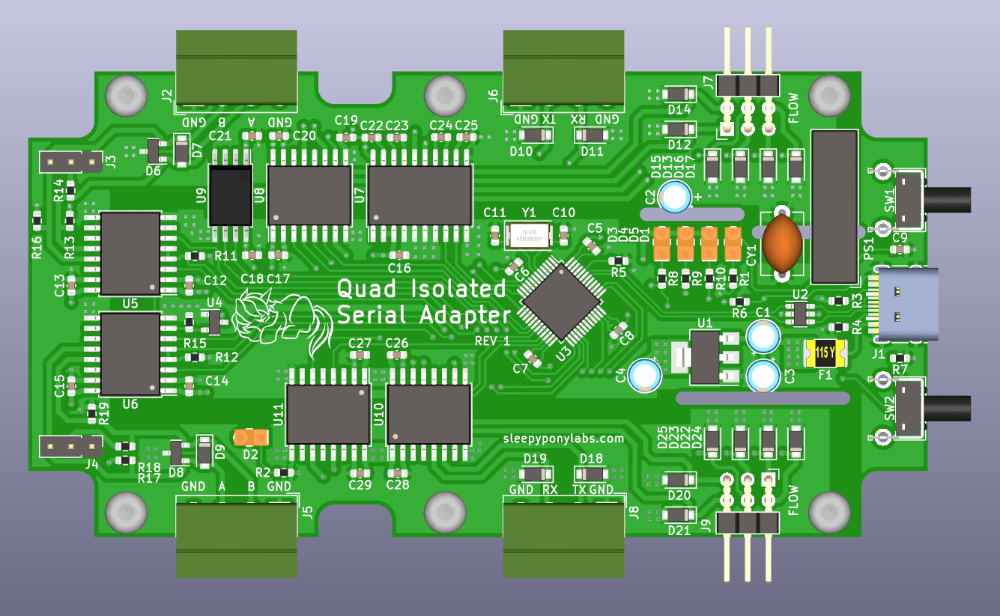

# Isolated Quad Serial Adapter

This is an open-source KiCAD design files for a four-channel isolated USB-to-Serial adapter based on CH344Q IC from WCH.

## Pictures

## Features

This adapter is convenient when you want to connect multiple serial devices to your computer simultaneously, while also provides isolation between your computer and those devices.

- Four USB-to-Serial channels
	- CH344Q IC: Only one USB required to communicate with all fours channels at the same time at maximum speed of 6Mbps.
	- 1024 bytes of RX FIFO buffer and 512 bytes of TX FIFO buffer per channel.
	- Configured as 2x RS485, 1x RS232, and 1x 5V UART channels.
	- Modem flow control signals for RS232 and UART.
	- Auto direction control for RS485.
	- RS485 120 Ohms termination resistors (on/off)
- Full Isolation
	- All power and data signals are fully isolated between the USB and the serial side.
	- ADM2483 dedicated RS485 isolation IC.
	- ADM3251 dedicated RS232 isolated IC.
	- Digital Isolator ICs for other signals.
	- 1W 5V isolated DC/DC converter.
- Other Protection
	- TVS diodes on all signals line, including the USB.
- Intuitive Interfaces
	- USB Type-C Connector
	- Degson 3.5mm terminal blocks for serial channels
	- Pin header breakout for modem signals
	- RX/TX indicators
	- USB connection good indicator
	- Power indicators on both side of the isolation
	- USB reset and flow control mode buttons
	- Design to fit a Futurebox FB17 project box
	
## Revisions

We are currently at Revision 1. Changelog is below:

**Revision 1 (November 2022)**
 - Initial Design
 - U9 has wrong footprint (could still be soldered with some difficulties)

## What is provided

The goal of this repository is to enable you to build this on your own as easy as possible. **The schematics, PCB design, and an interactive BOM is provided.**

Hardware is licensed under `SPDX-License-Identifier: CERN-OHL-S-2.0`

Contains no software

Documentation is licensed under `SPDX-License-Identifier: CC-BY-SA-4.0`

## Ordering

You can export gerbers from this project and order the board yourself. You can also use the link below to directly order from Aisler.

https://aisler.net/p/QCJIQNDV
